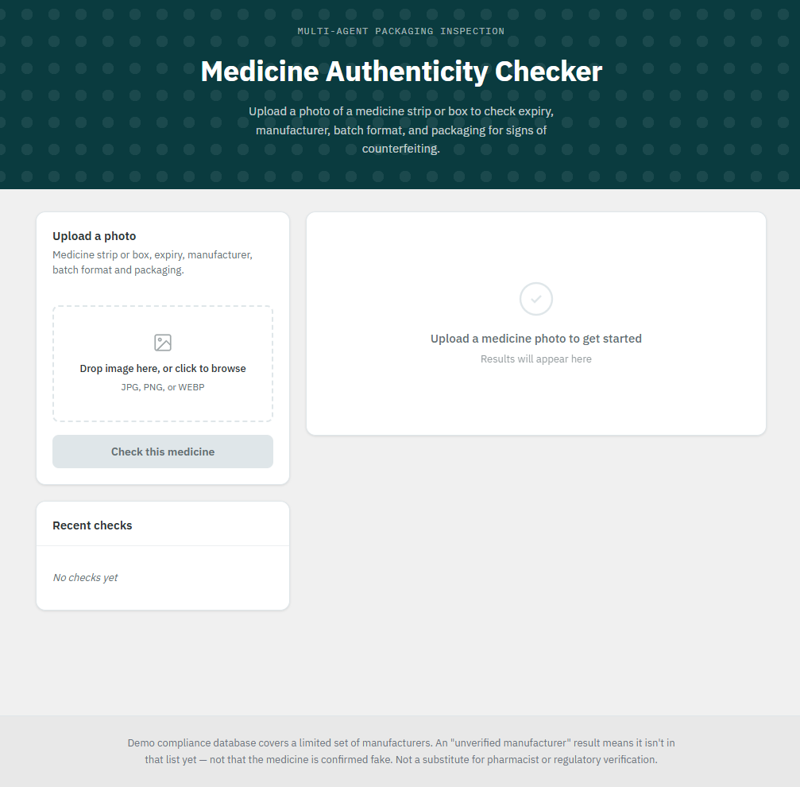
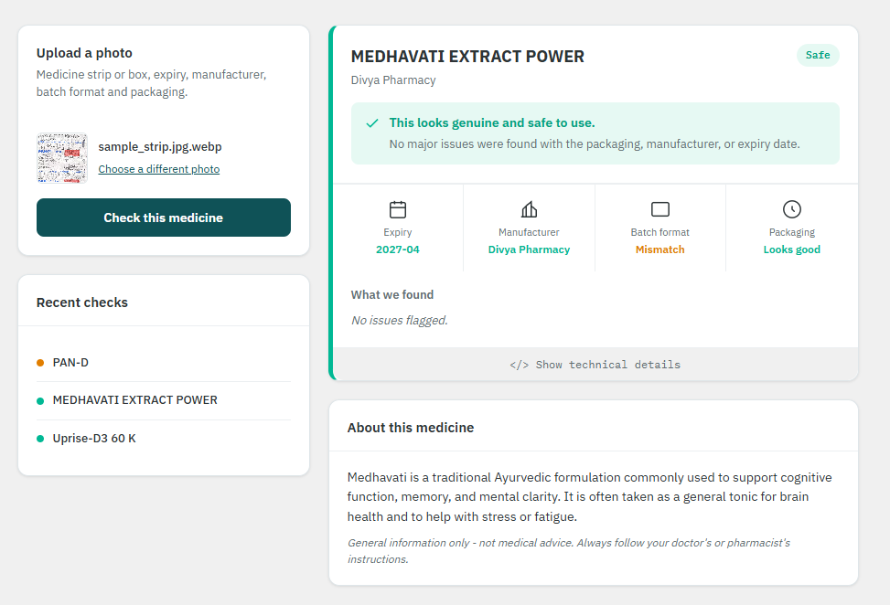
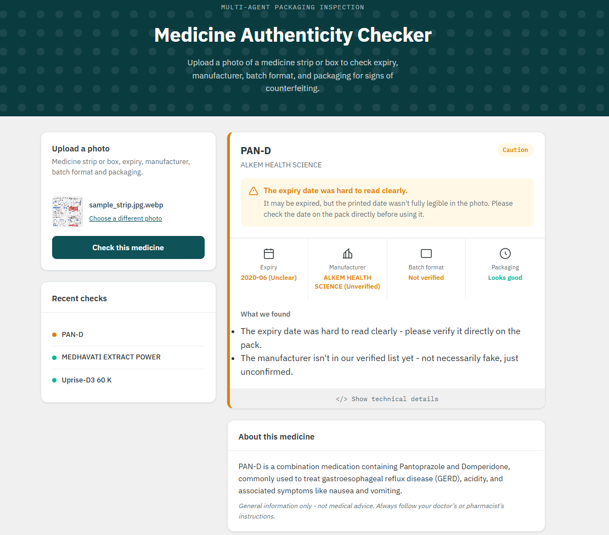
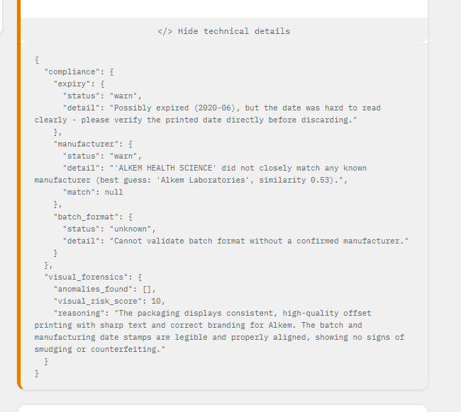
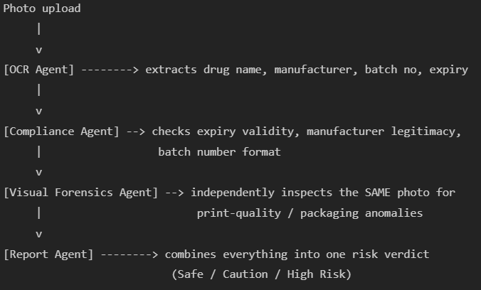

# Medicine Authenticity Checker

An intelligent, multi-agent computer vision system that verifies the authenticity of medicine strips via smartphone photos to combat counterfeit pharmaceuticals.

[](https://semver.org)
[](https://opensource.org/licenses/MIT)
[](https://github.com/DeadlyPro34/medicine-authenticity-checker)

---

## Project Overview

The Medicine Authenticity Checker is an AI-powered verification tool designed to mitigate the global health crisis of counterfeit medicines. It allows users to upload a photo of a medicine strip and instantly receive a risk assessment regarding its authenticity and safety.

The problem being solved is the proliferation of substandard or falsified medical products, particularly in low- and middle-income regions. This project exists to empower consumers, pharmacists, and supply-chain auditors with a rapid, accessible verification method without requiring specialized hardware.

The main objective is to utilize advanced vision language models in a multi-agent orchestration architecture to extract details, cross-reference them against known manufacturer compliance rules, and inspect the physical packaging for anomalies.

---

## Screenshots / Preview

### Landing Page

*Clean, responsive UI ready for a user to upload a photo of their medicine strip for instant AI verification.*

### Safe Result

*A verified medicine. The AI checks the expiry, batch format, and manufacturer to give a definitive Safe verdict.*

### Caution Result

*Flagging a suspicious medicine. If the manufacturer is not in the verified database, the AI warns the user immediately.*

### Technical Details

*Transparent AI reasoning. Expand the technical details to view the raw JSON output and confidence scores from the individual agents.*

---

## Demo

**Video Demo:**
[https://youtu.be/C8kgk0sDNpM](https://youtu.be/C8kgk0sDNpM)

**Live Demo:**
*[Link to live hosted version - Placeholder]*

---

## Features

### Core Verification Features
- Optical Character Recognition (OCR) for extracting text from glossy foil strips.
- Date extraction and validation to identify expired medicines.
- Batch number extraction and regex-pattern validation against manufacturer standards.
- Fuzzy string matching for manufacturer identification.

### UI / Experience Features
- Single-page application architecture.
- Two-column responsive card layout.
- Real-time processing indicators.
- Expandable technical payload inspector.

### Advanced Features
- Multi-agent AI orchestration pipeline.
- Visual Forensics processing to detect physical printing defects or packaging anomalies.
- Aggregated risk scoring system (Safe, Caution, High Risk).

---

## Technology Stack

**Frontend:**
- HTML5
- CSS3 (CSS Grid/Flexbox)
- Vanilla JavaScript

**Backend:**
- Python 3.9+
- FastAPI
- Uvicorn (ASGI server)

**AI / Machine Learning:**
- Groq Cloud API
- Llama 3.2 Vision (Vision LLM inference)

**Data Storage:**
- CSV (Local Manufacturer Registry Database)

---

## System Architecture

The system utilizes a sequential pipeline pattern where multiple specialized agents process the same input and pass their state forward.

```text
User 
  | (Uploads Photo)
  v
Frontend Client
  | (Multipart Form Data POST)
  v
FastAPI Backend (/verify)
  |
  +--> [OCR Agent] (Extracts raw text data)
  |
  +--> [Compliance Agent] (Validates rules, dates, and manufacturer registry)
  |
  +--> [Visual Forensics Agent] (Inspects physical packaging quality)
  |
  +--> [Report Agent] (Aggregates state and computes final risk score)
  |
  v
JSON Response
  |
  v
Frontend Client (Renders Verdict)
```



---

## Project Structure

```text
medicine-authenticity-checker/
│
├── backend/
│   ├── agents/               # AI agent modules (ocr, compliance, etc.)
│   ├── data/                 # Manufacturer CSV databases
│   ├── schemas.py            # Pydantic data models
│   ├── main.py               # FastAPI entry point
│   ├── requirements.txt      # Python dependencies
│   └── .env                  # Environment variables (git-ignored)
│
├── frontend/
│   └── index.html            # Single-page client interface
│
├── assets/                   # Images and documentation assets
├── .gitignore
└── README.md
```

- **backend/agents/**: Contains the isolated logic for each of the four AI agents.
- **backend/data/**: Contains `manufacturers.csv`, acting as the compliance database.
- **frontend/**: Contains the static assets served to the user.

---

## Installation & Setup Guide

### Step 1: Clone Repository

```bash
git clone https://github.com/DeadlyPro34/medicine-authenticity-checker.git
cd medicine-authenticity-checker
```

### Step 2: Install Backend Dependencies

Navigate to the backend directory and set up a virtual environment:

```bash
cd backend
python -m venv venv
```

Activate the virtual environment:
- Windows: `venv\Scripts\activate`
- macOS/Linux: `source venv/bin/activate`

Install the required packages:

```bash
pip install -r requirements.txt
```

### Step 3: Setup Environment Variables

In the `backend` directory, create a `.env` file:

```bash
touch .env
```

Add your Groq API key to the file:

```text
GROQ_API_KEY=your_groq_api_key_here
```

| Variable | Description |
|---|---|
| GROQ_API_KEY | API key required to authenticate with the Groq inference engine |

### Step 4: Start Application

Ensure your virtual environment is active, then start the FastAPI server:

```bash
uvicorn main:app --reload --host 0.0.0.0 --port 8000
```

The backend API will be available at `http://localhost:8000`. 
The frontend can be accessed directly by opening `frontend/index.html` in any modern web browser, or served via a basic HTTP server.

---

## Usage Guide

1. Open `frontend/index.html` in your web browser.
2. Click the upload area or drag-and-drop a clear, well-lit photograph of a medicine strip.
3. Click the "Check Authenticity" button.
4. Wait for the multi-agent pipeline to process the image (typically 3-5 seconds).
5. Review the final risk verdict, the extracted data in the checks grid, and read the specific findings.
6. Click "Show technical details" to review the raw JSON output from the AI agents.

---

## API Documentation

| Method | Endpoint | Description | Content-Type |
|---|---|---|---|
| POST | `/verify` | Submits an image for authenticity verification | `multipart/form-data` |
| GET | `/` | Health check endpoint | `application/json` |

---

## Database Schema (CSV Registry)

The application relies on a local CSV database (`manufacturers.csv`) for compliance checks.

- **name**: The official registered name of the manufacturer.
- **batch_pattern**: A regular expression defining the valid format for batch numbers.
- **notes**: Contextual information about the manufacturer.
- **aliases**: Pipe-separated string of alternative names or subsidiary prints found on packaging.

---

## Security Features

- **Environment Isolation**: API keys are strictly managed via environment variables and are never exposed to the frontend client.
- **Input Validation**: The backend utilizes FastAPI and Pydantic for strict schema validation of all AI agent outputs.
- **File Validation**: Uploaded files are validated for content type and size limits before processing.

---

## Performance Optimizations

- **Groq LPU Processing**: Utilizes Groq's Language Processing Units for ultra-low latency vision inference, reducing complex agent operations to seconds.
- **Stateless Architecture**: The backend agents maintain no state between requests, allowing for horizontal scaling.

---

## Deployment

To deploy using Docker (Assuming a Dockerfile is present):

```bash
docker build -t medicine-checker .
docker run -p 8000:8000 -e GROQ_API_KEY="your_key" medicine-checker
```

For production deployment, ensure the application is behind a reverse proxy (like Nginx) configured with SSL/TLS, and the frontend is hosted on a CDN or static file hosting service.

---

## Testing

To run the agent unit tests (if applicable):

```bash
cd backend
pytest
```

---

## Roadmap / Future Improvements

- Integration with official government drug registry APIs (e.g., CDSCO) for live batch verification.
- Mobile application development for native camera integration and on-device cropping.
- Expansion of the manufacturer database with wider global coverage.
- Support for barcode and QR code reading alongside OCR.

---

## Contributors

| Name | GitHub |
|---|---|
| Akhil | [@DeadlyPro34](https://github.com/DeadlyPro34) |

---

## Contributing Guidelines

1. Fork the repository
2. Create your feature branch (`git checkout -b feature/AmazingFeature`)
3. Commit your changes (`git commit -m 'Add some AmazingFeature'`)
4. Push to the branch (`git push origin feature/AmazingFeature`)
5. Open a Pull Request

---

## License

Distributed under the MIT License.

---

## Contact

**Project Owner:** Akhil  
**GitHub:** [https://github.com/DeadlyPro34](https://github.com/DeadlyPro34)  

---

## Acknowledgements

- Built using the [Groq Cloud API](https://groq.com/).
- Powered by Meta's [Llama 3.2 Vision](https://ai.meta.com/llama/).
- Backend framework powered by [FastAPI](https://fastapi.tiangolo.com/).
